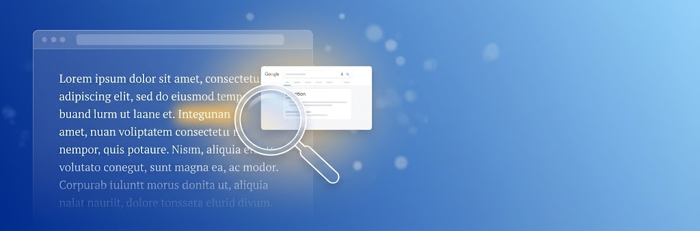
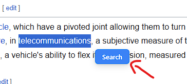
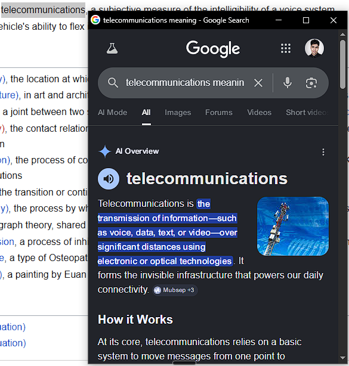

# Read Anchor




> Instantly search the meaning of any word or phrase on the web — without leaving your tab.

**Read Anchor** is a lightweight, privacy-first browser extension for Chromium-based browsers. Highlight any text on any webpage, click the floating **Search** button, and a clean popup window opens right at your cursor with Google Search results. Click back to your page and the popup vanishes automatically.

---

## Abstract

Modern reading happens inside the browser. Whether you're researching a paper, learning a new language, or just curious about a word in an article, the friction of copying text, opening a new tab, typing a search query, and finding your way back breaks focus and flow.

Read Anchor eliminates that friction entirely. It lives entirely in your browser, uses zero external dependencies, and sends no data to any third-party server. Your selected text is only used to construct a Google Search URL that opens in a minimal, chromeless popup window. The popup auto-dismisses the moment you click back to the main page, keeping your workspace clean.

Built on **Manifest V3** with vanilla JavaScript, Read Anchor is designed to be fast, unobtrusive, and transparent.

---

## Installation

For detailed, step-by-step installation instructions, see the **[Installation Guide](INSTALLATION_GUIDE.md)**.

In short:
1. Download or clone this repository.
2. Open your browser's Extensions page (`chrome://extensions/`, `brave://extensions/`, or `edge://extensions/`).
3. Enable **Developer mode**.
4. Click **Load unpacked** and select the Read Anchor folder.
5. Highlight any text on any page and click **Search**.

---

## How It Works

```
User selects text
       ↓
Content script detects selection (mouseup)
       ↓
Floating "Search" button injected near selection
       ↓
User clicks button
       ↓
Message sent to background service worker
       ↓
Background opens chrome.windows popup:
  https://www.google.com/search?q=[selected_text]+meaning
       ↓
User clicks back to main window
       ↓
Popup auto-closes (onFocusChanged listener)
```

---

## Screenshots

### Select any word



### Search instantly



---

## File Structure

```
ReadAnchor/
├── manifest.json          # MV3 config, permissions, script registration
├── background.js          # Service worker — window creation & lifecycle
├── content.js             # Content script — selection detection & UI injection
├── styles.css             # Scoped floating button styles
├── icons/
│   ├── icon16.png
│   ├── icon48.png
│   └── icon128.png
├── assets/                # Screenshots and banner images
├── README.md              # This file
├── INSTALLATION_GUIDE.md  # Detailed local installation steps
└── PRIVACY_POLICY.md      # Privacy policy
```

---

## Permissions

| Permission | Why it's needed |
|------------|-----------------|
| `scripting` | Injects the content script that detects text selection and renders the floating button. |
| `activeTab` | Allows the extension to interact with the current tab when the user initiates a search. |

No browsing history, cookies, or personal data is accessed.

---

## Tech Stack

- **Manifest V3** — Modern Chrome extension standard
- **Vanilla JavaScript** — No frameworks, no bundlers, no dependencies
- **`chrome.windows` API** — Native popup window management
- **Scoped CSS** — All styles isolated to `#lexical-search-btn`

---

## Browser Support

Read Anchor works on any Chromium-based browser with Manifest V3 support:

| Browser | Extensions Page | Notes |
|---------|----------------|-------|
| **Google Chrome** | `chrome://extensions/` | Primary target |
| **Brave** | `brave://extensions/` | Fully compatible; Shields does not block extension popups |
| **Microsoft Edge** | `edge://extensions/` | Fully compatible |

---

## Privacy

See the **[Privacy Policy](PRIVACY_POLICY.md)** for details on how Read Anchor handles user data.

In short: Read Anchor does not collect, store, or transmit any personal data.

---

## License

MIT
